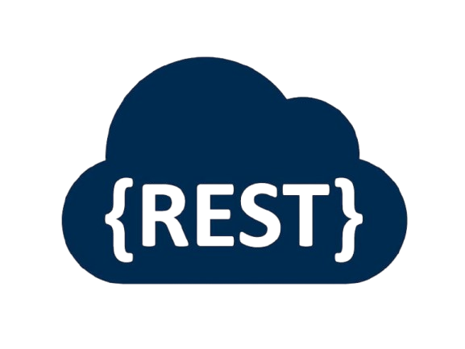
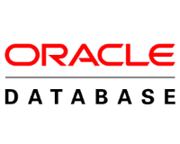

# 👋 Bonjour ! 
## 💖 Bienvenue sur ma page
Je suis Enzo, un étudiant français actuellement en Master 1 Informatique à l'université Grenoble Alpes. J'adore transformer mes idées en vrai projet à valeur. Je suis un peu touche à tout, mais je préfère particulièrement travailer sur des interfaces Front End avec des technologies comme Vue.js, Tailwind CSS ou Java Swing. 

## 💻 Je travaille actuellement sur ...
### 🏜️ TheFlowRush
[TheFlowRush](https://theflowrush.com) est une boutique en ligne de vêtements de seconde-main. J'en suis un des fondateurs et je réalise une bonne partie du sourcing, des annonces et des expéditions des commandes. Je développe aussi le site web de la boutique et divers outils internes pour faciliter la gestion de l'inventaire et des ventes.

### 📚 Projets personnels
- Mon système de producitivité personnel : [ProductivitySystem](https://github.com/Deo-Favente/ProductivitySystem)
- Mon site portofolio : [deo-favente.fr](https://deo-favente.fr)

### 💻 Projets scolaires
- Sur demande, change selon les semestres.

## 🔧 Mes compétences techniques incluent...
<table>
<tr>
  <td align="center" valign="bottom" width="96">
     JavaScript
  </td>
  <td align="center" valign="bottom" width="96">
     Node.js
  </td>
  <td align="center" valign="bottom" width="96">
     Vue.js
  </td>
  <td align="center" valign="bottom" width="96">
     Tailwind CSS
  </td>
  <td align="center" valign="bottom" width="96">
     Bootstrap
  </td>
  <td align="center" valign="bottom" width="96">
     HTML
  </td>
  <td align="center" valign="bottom" width="96">
     CSS
  </td>
</tr>

<tr>
  <td align="center" valign="bottom" width="96">
     Java
  </td>
  <td align="center" valign="bottom" width="96">
     Swing
  </td>
  <td align="center" valign="bottom" width="96">
     Spring
  </td>
  <td align="center" valign="bottom" width="96">
     Hibernate JPA
  </td>
  <td align="center" valign="bottom" width="96">
     Python
  </td>
  <td align="center" valign="bottom" width="96">
     Flask
  </td>
  <td align="center" valign="bottom" width="96">
     SQLite
  </td>
</tr>

<tr>
  <td align="center" valign="bottom" width="96">
     C
  </td>
  <td align="center" valign="bottom" width="96">
     Linux
  </td>
  <td align="center" valign="bottom" width="96">
     Git
  </td>
  <td align="center" valign="bottom" width="96">
     GitHub
  </td>
  <td align="center" valign="bottom" width="96">
     GitLab
  </td>
  <td align="center" valign="bottom" width="96">
     REST API
  </td>
  <td align="center" valign="bottom" width="96">
     Oracle DB
  </td>
</tr>
</table>

## 💪 J'ai contribué pour des projets Open Source comme ...

## 📨 Comment me contacter
- Mail : [Cliquer ici](mailto:deofavente.dev@gmail.com)
- LinkedIn : [Mon profil](https://www.linkedin.com/in/enzo-de-oliveira-favente/)
