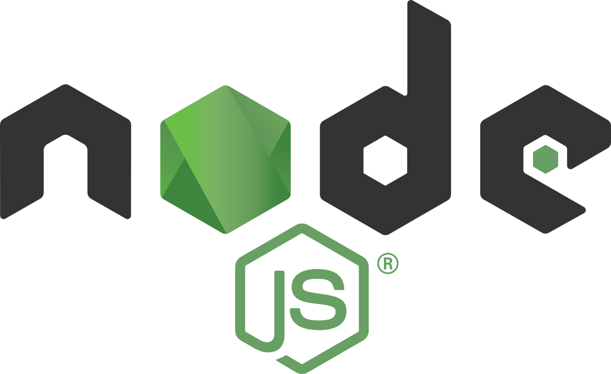
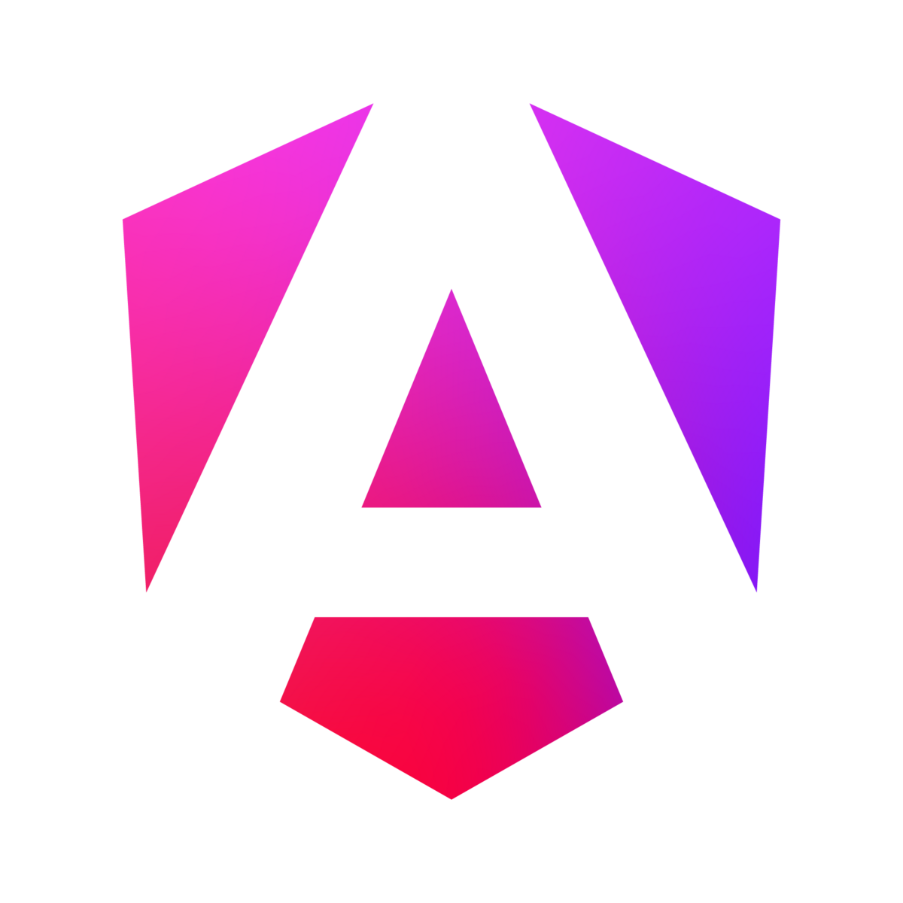
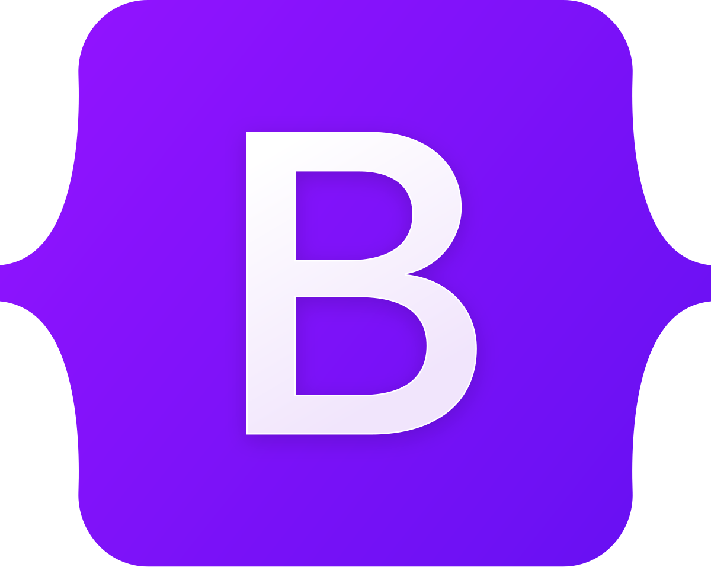
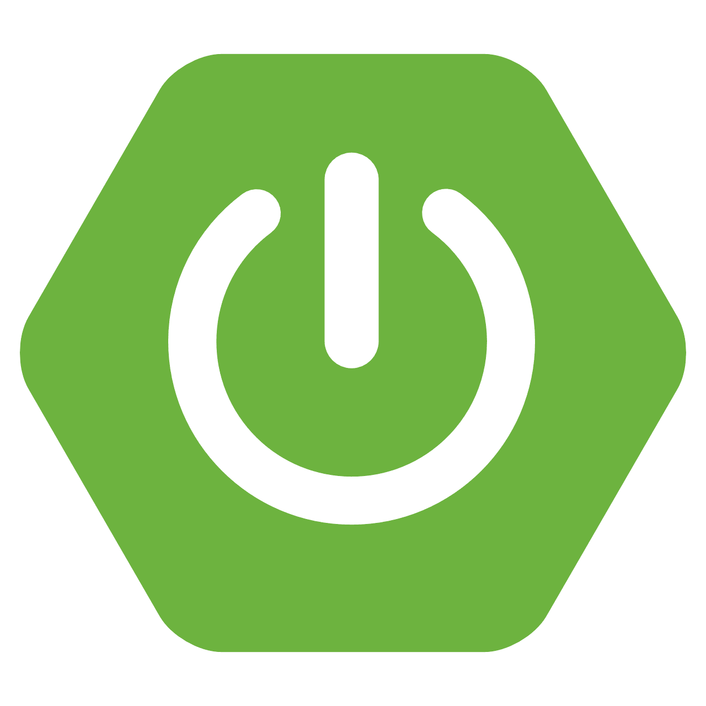
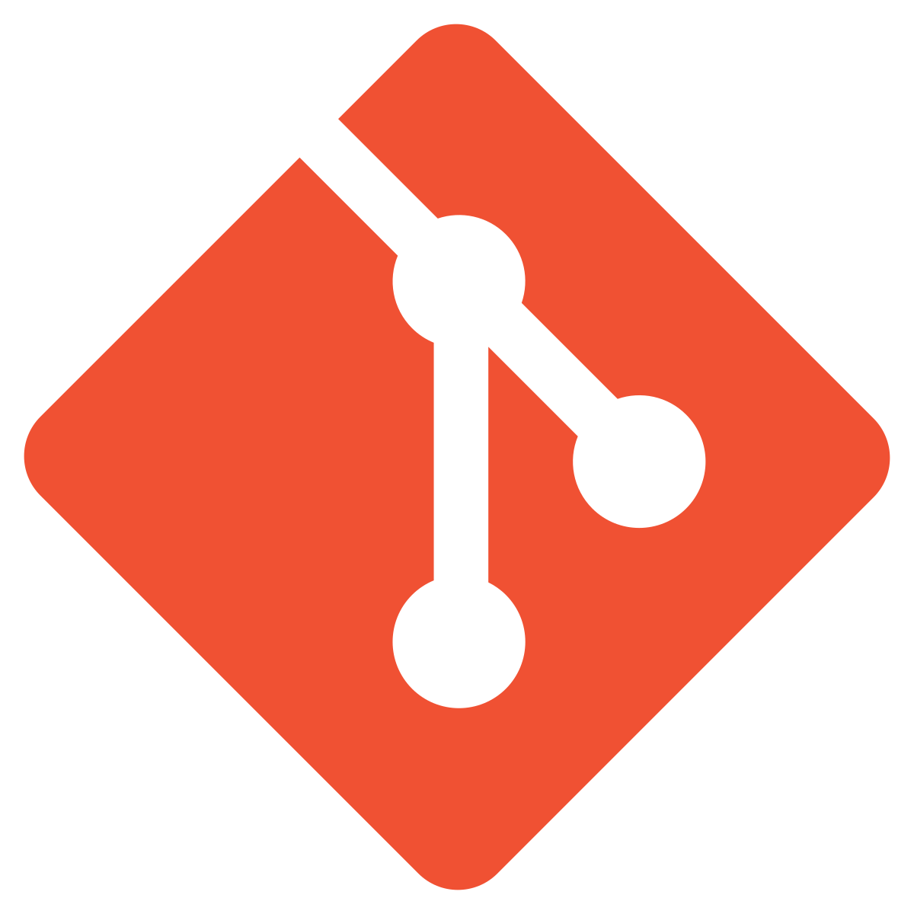
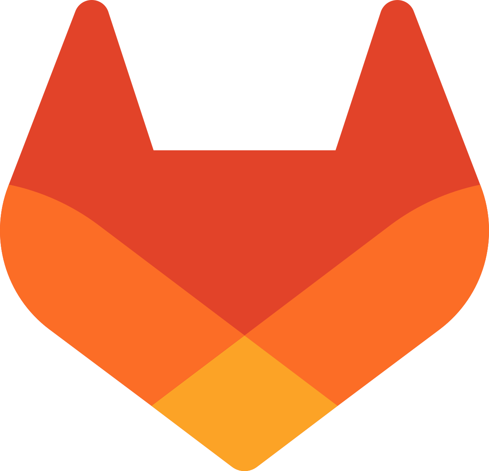
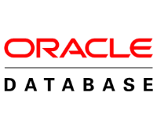

# 👋 Bonjour ! 
## 💖 Bienvenue sur ma page
Je suis Enzo, un étudiant français actuellement en Master 1 Informatique à l'université Grenoble Alpes. J'adore transformer mes idées en vrai projet à valeur. Je suis un peu touche à tout, mais je préfère particulièrement travailer sur des interfaces Front End intuivites avec des technologies comme Angular, TailwindCSS ou Java Swing. Je suis également en plein aprentissage des bonnes pratiques DevOps et j'essaye de les appliquer dans mes projets.

## 💻 Je travaille actuellement sur ...
### 🏜️ TheFlowRush
[TheFlowRush](https://theflowrush.com) est une boutique en ligne de vêtements de seconde-main. J'en suis un des fondateurs et je réalise une bonne partie du sourcing, des annonces et des expéditions des commandes. Je développe aussi le site web de la boutique et divers outils internes (voir section suivante) pour faciliter la gestion de l'entreprise.

### 💻 Projets scolaires
- Démonstration sur demande, change selon les semestres.

## 🔧 Mes compétences techniques incluent...
<table>
<tr>
  <td align="center" valign="bottom" width="96">
     JavaScript
  </td>
  <td align="center" valign="bottom" width="96">
     Node.js
  </td>
  <td align="center" valign="bottom" width="96">
     Angular
  </td>
  <td align="center" valign="bottom" width="96">
     Tailwind CSS
  </td>
  <td align="center" valign="bottom" width="96">
     Bootstrap
  </td>
  <td align="center" valign="bottom" width="96">
     HTML
  </td>
  <td align="center" valign="bottom" width="96">
     CSS
  </td>
</tr>

<tr>
  <td align="center" valign="bottom" width="96">
     Java
  </td>
  <td align="center" valign="bottom" width="96">
     Swing
  </td>
  <td align="center" valign="bottom" width="96">
     Vue.js
  </td>
  <td align="center" valign="bottom" width="96">
     SpringBoot
  </td>
  <td align="center" valign="bottom" width="96">
     Hibernate JPA
  </td>
  <td align="center" valign="bottom" width="96">
     Python
  </td>
  <td align="center" valign="bottom" width="96">
     SQLite
  </td>
</tr>

<tr>
  <td align="center" valign="bottom" width="96">
     C
  </td>
  <td align="center" valign="bottom" width="96">
     Linux
  </td>
  <td align="center" valign="bottom" width="96">
     Git
  </td>
  <td align="center" valign="bottom" width="96">
     GitHub
  </td>
  <td align="center" valign="bottom" width="96">
     GitLab
  </td>
  <td align="center" valign="bottom" width="96" height="96">
     Figma
  </td>
  <td align="center" valign="bottom" width="96">
     Oracle DB
  </td>
</tr>
</table>

## 💪 J'ai contribué pour des projets Open Source comme ...
*(Mise à jour de cette section à suivre)* 

## 📨 Comment me contacter
- Mail : [Cliquer ici](mailto:deofavente.dev@gmail.com)
- LinkedIn : [Mon profil]()
